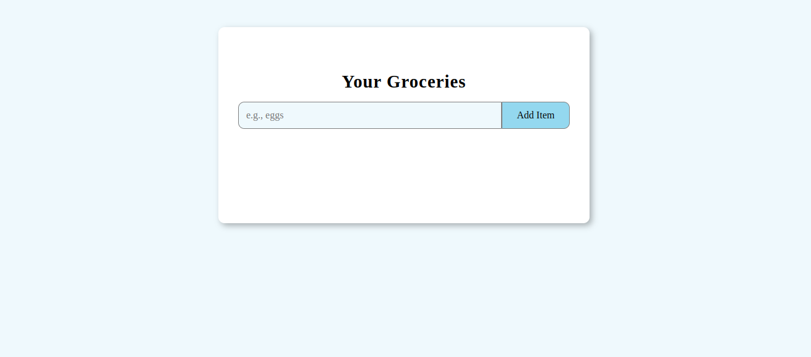

# Your Grocery

A clean, responsive web application for managing your grocery shopping list built with  `HTML`, `CSS`, and `JavaScript`.

## Features

- `Add Items` : Quickly add new items to your grocery list
- `Edit Items` : Update existing items with a simple edit function
- `Delete Items` : Remove individual items you no longer need
- `Clear All`: One-click removal of all items
- `Persistent Storage`: Your list is saved in local storage between visits
- `Responsive Design`: Works on desktop and mobile devices
- `Visual Feedback`: Color-coded alerts confirm your actions

## Usage

**Add an Item:**

> Type the grocery item name in the input field

> Click "Add Item" or press Enter

**Edit an Item:**

> Click the "Edit" button on an item

> Modify the text in the input field

> Click "Update" to save changes

**Delete an Item:**

> Click the "Delete" button on an item to remove it

**Clear All Items:**

> Click the "Clear All Items" button at the bottom to remove everything

## Technology Stack

### `HTML5` : Structure and content
### `CSS3` : Styling and responsive design
### `JavaScript` : Functionality and interactivity
### `Local Storage API` : Data persistence

## Browser Support

This application works on all modern browsers including:

#### Chrome
#### Brave
#### Firefox
#### Safari
#### Edge

